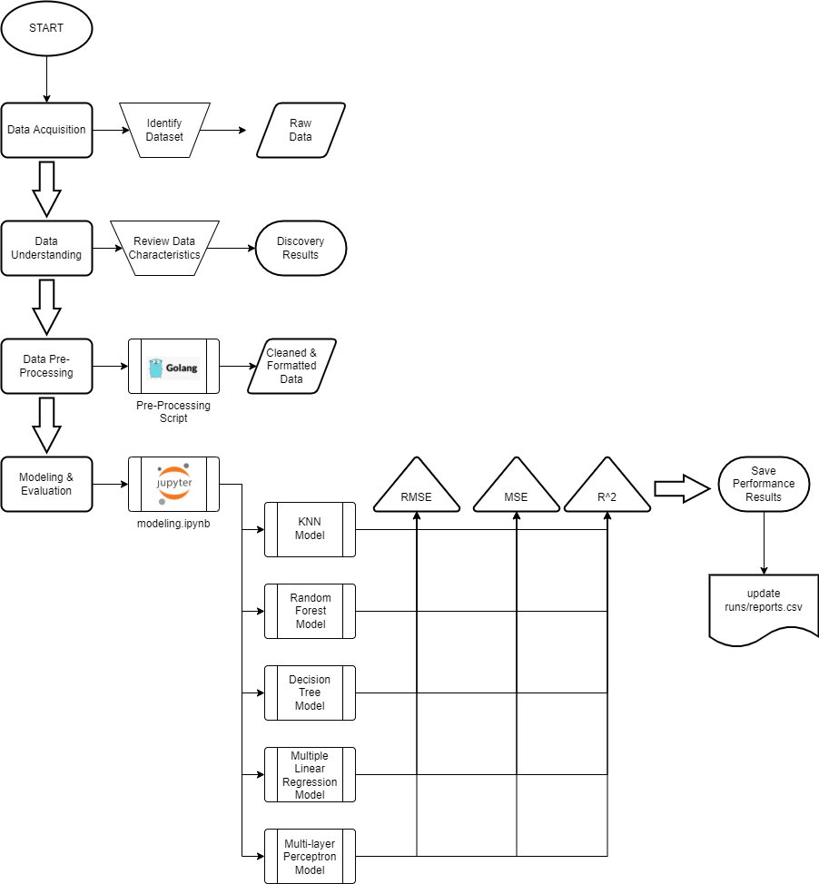

# nfl_ml_project

NOTE: this is an academic project and cannot accept contributions until 12/14/2021

### Abstract

Fantasy football is a multi-billion-dollar industry where individuals from across the world join fantasy football leagues to draft National Football League (NFL) football players onto their own fantasy team and compete against other individual’s fantasy teams. The individuals, also referred to as “owners” or “team owners”, assess NFL player and team statistics to project which NFL players on their active roster and bench will accumulate the most points in the fantasy football scoring system. The objective of this project is to explore machine learning approaches to predicting the fantasy scores achieved by NFL players on a per game basis. The project utilized several different supervised learning techniques to identify the optimal solution and provide analysis for use in future efforts.

## Table of Contents

1. Directory Structure
2. Machine Learning Pipeline
3. Development Environment Setup
4. Executing Scripts/Code

## Directory Structure

```bash
├───.devcontainer # dev environment
├───code # all code developed by the project team
│   ├───data_understanding # random scripts to understand contents of raw data
│   ├───modeling # jupyter NB and requirements.txt for running models
│   ├───post_processing # random scripts to review post modeling results
│   └───pre_processing # golang script to take raw data and produce formatted csv
├───data # all data associated with the project
│   ├───clean_formatted # pre-processed CSV used for modeling
│   ├───raw # the raw csv data requiring pre-processing before modeling
│   └───results # all performance metrics and testing results
└───imgs # images associated with the project
```

## Machine Learning Pipeline



## Development Environment Setup

1. Install VS Code ([link](https://code.visualstudio.com/Download))
2. Follow Instructions for Remote Containers ([link](https://code.visualstudio.com/docs/remote/containers))
3. Clone this repository ([clone link](https://github.com/JeffRDay/nfl_ml_project.git))
4. open `nfl_ml_project` directory in VS Code
5. if not prompted, press F1 (if windows) or otherwise open command palette.
6. type `remote-containers`
7. select `Remote-Containers: Open Folder in Container`
8. click `open`
9. VS Code should launch the development environment
10. contact the project team if any issues persist

of note: Jupyter Notebooks must be executed outside of the dev environment (i.e., on the local desktop. The dev environment supports .go, .py, and testing with mongoDb).

## Executing scripts

This project uses Go to pre-process the raw data located in `/data/raw`, because we value our time. To execute the go script:

### Download the latest release

1. Download latest release for your system architecture from [XXX]()

NOTE: Due to resource limitations, only able to text on 64-bit linux and windows operating systems.

2. copy the executable into `/code/pre_processing`. This **MUST** be done. The script is dependent on the file structure of this repo at this time.

### Follow the development environment setup instructions

cd into `/code/pre-processing`
```bash
cd code/pre-processing
```

run the go script
```bash
go run ./...
```
